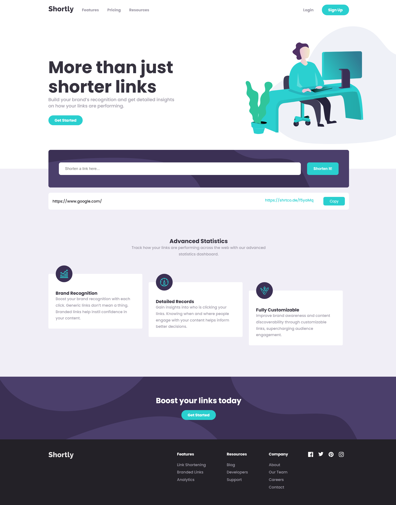

## Table of contents

- [Overview](#overview)
  - [The challenge](#the-challenge)
  - [Screenshot](#screenshot)
  - [Links](#links)
- [My process](#my-process)
  - [Built with](#built-with)
  - [What I learned](#what-i-learned)
- [Author](#author)

## Overview

### The challenge

Users should be able to:

- View the optimal layout for the site depending on their device's screen size
- Shorten any valid URL
- See a list of their shortened links, even after refreshing the browser
- Copy the shortened link to their clipboard in a single click
- Receive an error message when the `form` is submitted if:
  - The `input` field is empty

### Screenshot



### Links

- Solution URL: [](https://www.frontendmentor.io/challenges/url-shortening-api-landing-page-2ce3ob-G)
- Live Site URL: [](https://shortly-url-shortening-api.netlify.app/)

## My process

### Built with

- Semantic HTML5 markup
- CSS custom properties
- Flexbox
- Javascript
- Shortly API

### What I learned

I was happy to learn how to incorporate local storage to save previously shortened links and display them on page load. 

I had an issue with each link being displayed twice, caused by running a function that both saves and displays local storage data along with running the displayLinks function on form submit. I fixed this bug by checking for and displaying saved local storage data on app init. Then only running a save to local storage and display function after the form is submitted and the API data is returned.

This is is my working code:

This block runs after the API data is returned.
```
.then(data => {
        if (data) {
            const shortLink = data.result;
            app.savedLinks(shortLink);
        } else {
            return;
        }
    })
```

```
app.savedLinks = (link) => {
    let linksArray = localStorage.getItem('items') ? JSON.parse(localStorage.getItem('items')) : [];
    
    const linkObj = {
        original_link: link.original_link,
        full_short_link: link.full_short_link
    }

    linksArray.push(linkObj)
    localStorage.setItem('items', JSON.stringify(linksArray))
    app.displayLinks(link);
}
```

This block checks for any saved local storage data and displays it

```
const datas = JSON.parse(localStorage.getItem('items'))
    
    if (datas) {
        datas.forEach(item => {
            app.displayLinks(item);
        })
    }
```


## Author

- Website - [Tiffany Fust](https://tiffanyfust.ca/)

